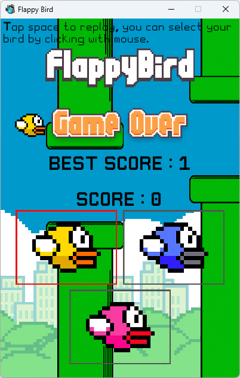

# flappybird-pygame

Clone du jeu Flappy Bird en utilisant Pygame, avec gestion des éléments graphiques, de la physique du jeu et des scores.

## Description

Ce projet, réalisé dans le cadre d'un projet NSI, est une réplique du célèbre jeu Flappy Bird, développé en utilisant la bibliothèque Pygame. Il inclut la gestion des éléments graphiques, de la physique du jeu et des scores. 

## Demo

## Prérequis

- Python 3.x
- Pygame
